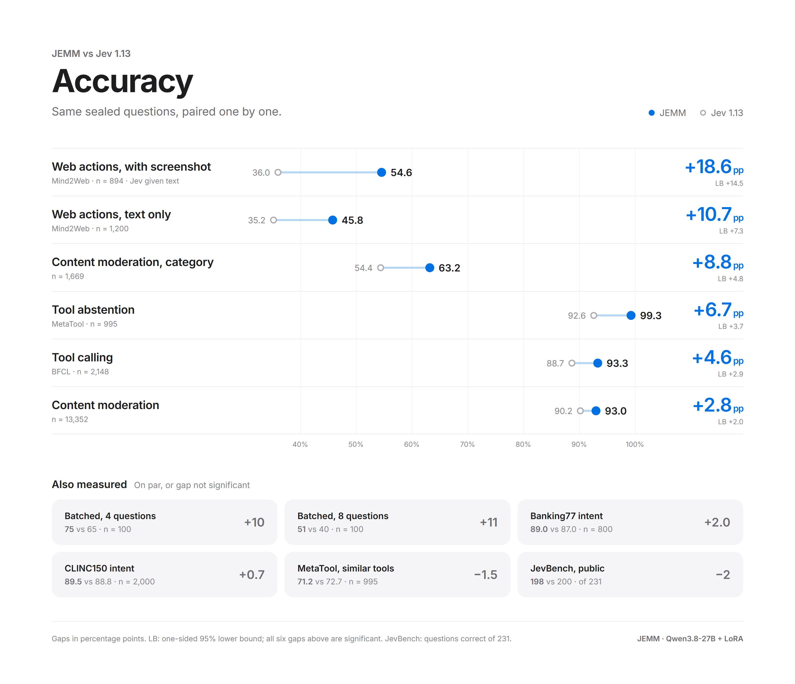
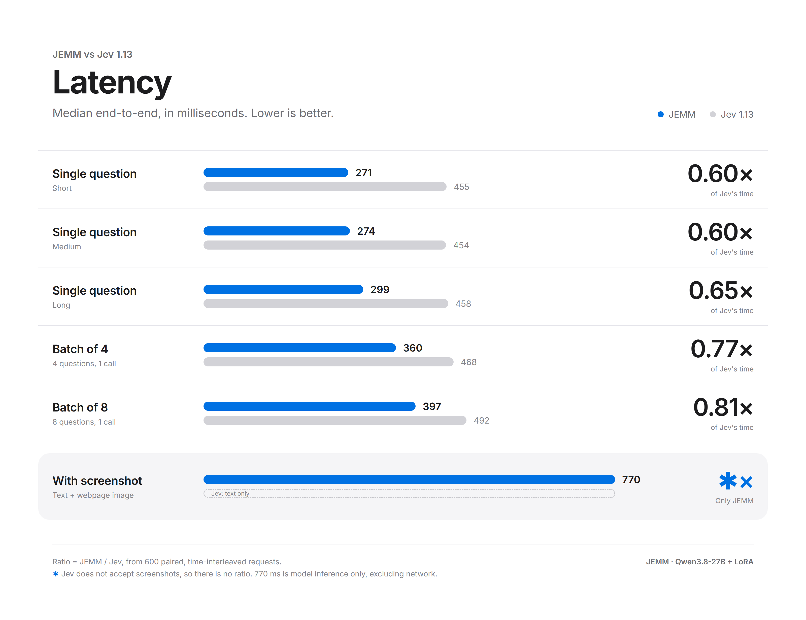
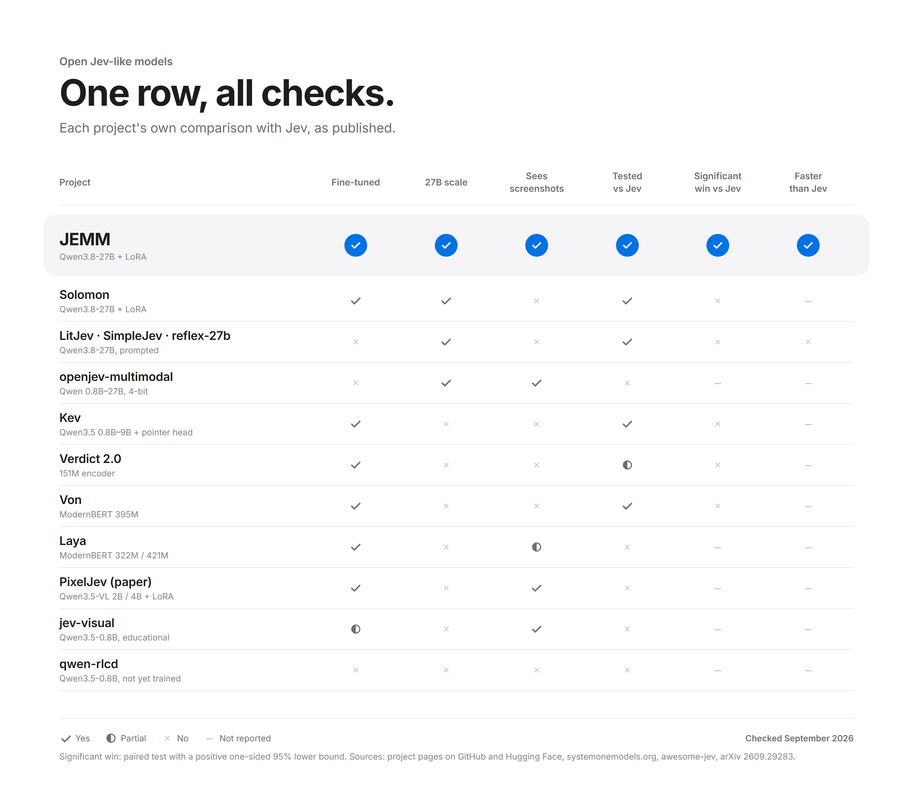

# JEMM

JEMM stands for Judgment Engine for MultiModal decisions. This repository serves the [JEMM](https://huggingface.co/MaestroYan/JEMM) adapter over HTTP; the model card shows usage without this server. Needs one CUDA GPU with at least 64 GB.







## Usage

```bash
pip install git+https://github.com/ypcypc/JEMM
python -m jemm.serve --adapter MaestroYan/JEMM --port 8790
```

```bash
curl -s http://127.0.0.1:8790/v1/systemone -H "Content-Type: application/json" -d '{
  "state": "User: Will it rain in Paris tomorrow?",
  "questions": {"tool": {"type": "choice", "instructions": "Which tool should handle the request?",
    "criteria": {"get_weather": "Weather forecast for a city", "search_flights": "Flight search", "none": "No tool applies"}}}
}'
```

- `type`: `choice` (2 to 32 options), `noul` (`{"true": ..., "false": ...}`) or `score` (a list of levels).
- `images` (optional): up to 4 base64 PNG, JPEG or WebP screenshots, seen by every question.
- Each answer has `probabilities` and `confidence`. Treat `confidence` below `threshold` in `decision_config.json` as undecided.

Apache-2.0. Not affiliated with TypeSafe AI.
